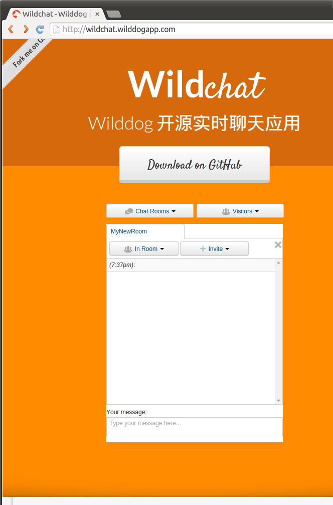
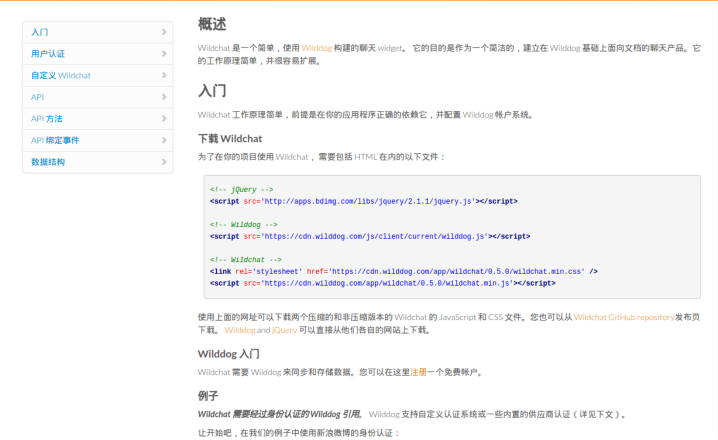

# demo-js-wildchat — Wilddog 开源实时聊天应用

Wildchat 是使用 [Wilddog](https://www.wilddog.com/) 一个开源的、实时的聊天应用。它提供完全多用户，多房间，用户搜索，站内短信，聊天邀请等等。

## 在线示例

访问 [wildchat.wilddogapp.com](http://wildchat.wilddogapp.com/)  查看 Wildchat 在线示例.

[](http://wildchat.wilddogapp.com/)

在线文档

[](http://wildchat.wilddogapp.com/docs/)

## 本地运行
首先确认本机已经安装 [Node.js](http://nodejs.org/) 运行环境，然后执行下列指令：

```
git clone git@github.com:WildDogTeam/demo-js-wildchat.git
cd  demo-js-wildchat
```

安装依赖：

```
npm install
bower install
```

编译项目：

```
grunt
```

生成结果：

```
dist/
├── wildchat.css
├── wildchat.js
├── wildchat.min.css
└── wildchat.min.js
```

## 生成本地文档
**本地文档是用jekyll构建的，jekyll需要ruby环境的运行环境。如果没有ruby环境，可以查看上面的在线文档。**

```
cd website/
jekyll s
```

生成web部署文件：

```
jekyll build
```

生成结果：

```
_site/
├── css
│   ├── pygments-borland.css
│   └── styles.css
├── docs
...

12 directories, 32 file
```

## 下载

Wildchat 工作原理简单，前提是在你的应用程序正确的依赖它，并配置 Wilddog 帐户系统。
为了在你的项目使用 Wildchat， 需要包括 HTML 在内的以下文件：

```HTML
<!-- jQuery -->
<script src='http://apps.bdimg.com/libs/jquery/2.1.1/jquery.min.js'></script>

<!-- Wilddog -->
<script src='https://cdn.wilddog.com/js/client/current/wilddog.js'></script>

<!-- Wildchat -->
<link rel='stylesheet' href='https://cdn.wilddog.com/app/wildchat/0.5.0/wildchat.min.css' />
<script src='https://cdn.wilddog.com/app/wildchat/0.5.0/wildchat.min.js'></script>
```

使用上面提到的URL可以从Wilddog的CDN上下载到Wildchat的精简版和非精简版。你也可以从Wilddog的Github中下载他们。当然啦，Wilddog可以在各自的官网上下载。


你也可以通过npm 或者 bowr安装Wildchat, 他们会自动下载依赖。

```bash
$ npm install wildchat --save
```

```bash
$ bower install wildchat --save
```
## 示例代码

- 添加用户登录

```HTML
<script>
// Create a new Wilddog reference, and a new instance of the Login client
var chatRef = new Wilddog('https://<YOUR-WILDDOG>.wilddogio.com/chat');

function login() {
  chatRef.authWithOAuthPopup("weibo", function(error, authData) {
    if (error) {
      console.log(error);
    }
  });
}

chatRef.onAuth(function(authData) {
  //  一旦通过验证，Wildchat实例携带我们的用户ID和用户名
  if (authData) {
    initChat(authData);
  }
});
</script>

<a href='#' onclick='login();'>登录微博</a>
```
    
- 初始化一个聊天。

```HTML
<script>
function initChat(authData) {
  var chat = new WildchatUI(chatRef, document.getElementById('wildchat-wrapper'));
  chat.setUser(authData.uid, authData[authData.provider].displayName);
}
</script>

<div id='wildchat-wrapper'></div>
```

## 注册Wilddog

Wildchat 需要 Wilddog 来同步和存储数据。您可以在这里[注册](https://www.wilddog.com/my-account/signup)一个免费帐户。


## 支持
如果在使用过程中有任何问题，请提 [issue](https://github.com/WildDogTeam/demo-js-wildchat/issues) ，我会在 Github 上给予帮助。

## 相关文档

* [demo-ios-wildchat](https://github.com/WildDogTeam/demo-ios-wildchat) Wildchat iOS 版本
* [Wilddog 概览](https://z.wilddog.com/overview/guide)
* [JavaScript SDK快速入门](https://z.wilddog.com/web/quickstart)
* [JavaScript SDK 开发向导](https://z.wilddog.com/web/guide/1)
* [JavaScript SDK API](https://z.wilddog.com/web/api)
* [下载页面](https://www.wilddog.com/download/)
* [Wilddog FAQ](https://z.wilddog.com/faq/qa)
* [jekyll 中文](http://jekyll.bootcss.com/docs/home/) 开源软件，功能是将纯文本转化为静态网站和博客
* [jekyll 中文安装文档](http://jekyll.bootcss.com/docs/installation/)

## License
MIT
http://wilddog.mit-license.org/

## 感谢 Thanks

demo-js-wildchat is built on and with the aid of several  projects. We would like to thank the following projects for helping us achieve our goals:

Open Source:

* [firechat](https://github.com/firebase/firechat) Real-time Chat powered by Firebas
* [JQuery](http://jquery.com) The Write Less, Do More, JavaScript Library

